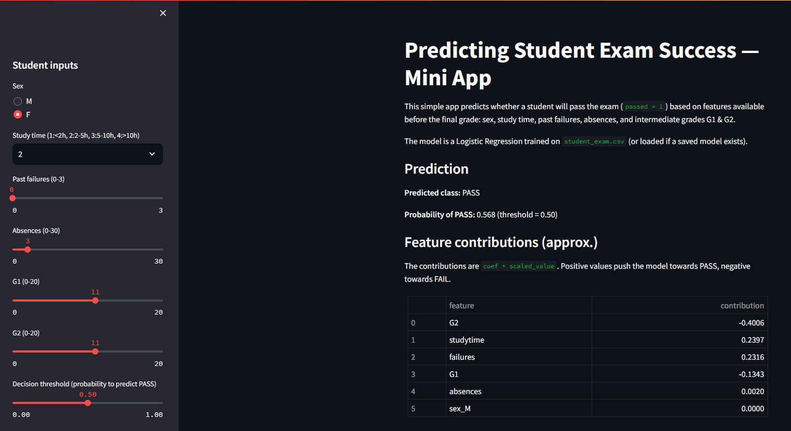
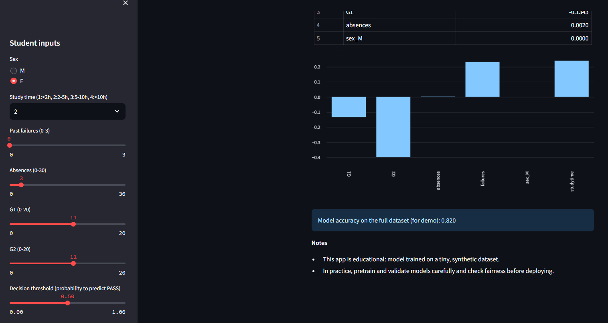

# student-exam-predictor
Mini Data Science course for beginners demonstrating the full workflow: exploring a student dataset, building a simple classifier to predict exam pass/fail, analyzing results, and deploying a Streamlit app for interactive predictions.

# 🧠 Predicting Student Exam Success: A Beginner’s Guide to Data Science

This repository contains a **mini data science course** designed for complete beginners.  
The project demonstrates the full data science workflow applied to a relatable problem:  
**Can we predict whether a student will pass or fail an exam?**

---

## 📂 Project Structure

course/
lesson1.ipynb # Exploring the dataset
lesson2+3.ipynb # Building a simple model and Analyzing the results
lesson4.ipynb # Deploying a predictor app
student_exam.csv # Example dataset

predictor_app.py # Streamlit predictor app
requirements.txt # Project dependencies
README.md # Project description
.gitignore # Files/folders to ignore in Git

---

## 🎯 Learning Outcomes

By completing this course, students will:

- Understand the basic data science workflow
- Load and explore real-world-like data
- Train and evaluate a simple ML classifier
- Build and deploy a simple ML app with Streamlit
- Think critically about model results and fairness

---

## 🚀 How to Run

### 1. Clone the repository

git clone https://github.com/ZainAlabdinShbani/student-exam-predictor.git
cd student-exam-predictor

### 2. Install dependencies

pip install -r requirements.txt

### 3. Open the lessons

jupyter notebook course/lesson1.ipynb

### 4. Run the Streamlit app

streamlit run predictor_app.py

## Example Output

Here is an example of the prediction result from the simulator:





## 📦 Deliverables
4 Jupyter lessons (lesson1-4.ipynb)
Dataset (student_exam.csv)
Streamlit app (predictor_app.py)
README and requirements for easy setup

## 🔄 Stretch Challenge
Try to improve the model:
Add more features (e.g., health, family support)
Test Random Forest or cross-validation
Compare multiple models

## 👩‍💻 Author
Data Science Intern Task by Zain Alabidin Shbani

Contact / Email: zain.alabidin.shbani@gmail.com

##📝 Notes:
The student_exam.csv dataset is synthetic for learning purposes.

The project focuses on beginner-friendly workflow, so the model is simple and not production-ready.

Feature contributions in the Streamlit app are approximate and based on scaled logistic regression coefficients.

Feel free to extend the course by adding more features, models, or improving the app UI.
```

